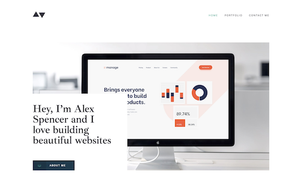
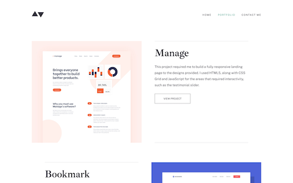
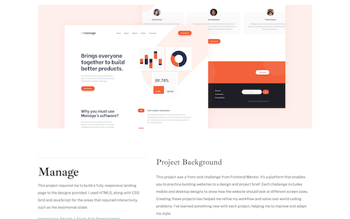
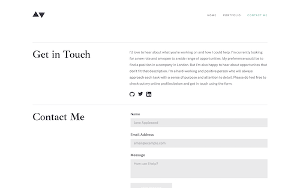

# Frontend Mentor - Minimalist portfolio website solution

This is a solution to the [Minimalist portfolio website challenge on Frontend Mentor](https://www.frontendmentor.io/challenges/minimalist-portfolio-website-LMy-ZRyiE). Frontend Mentor challenges help you improve your coding skills by building realistic projects. 

## Table of contents

- [Overview](#overview)
  - [The challenge](#the-challenge)
  - [Screenshots](#screenshots)
  - [Links](#links)
- [My process](#my-process)
  - [Built with](#built-with)
  - [Useful resources](#useful-resources)
- [Author](#author)

## Overview

### The challenge

Users should be able to:

- View the optimal layout for each page depending on their device's screen size
- See hover states for all interactive elements throughout the site
- Click the "About Me" call-to-action on the homepage and have the screen scroll down to the next section
- Receive an error message when the contact form is submitted if:
  - The `Name`, `Email Address` or `Message` fields are empty should show "This field is required"
  - The `Email Address` is not formatted correctly should show "Please use a valid email address"

### Screenshots

### Links

- Solution URL: [Github Repo](https://github.com/KatherineEbel/ke-fem-portfolio)
- Live Site URL: [Deployed on Vercel](https://ke-fem-portfolio.vercel.app/

## My process

### Built with

- Semantic HTML5 markup
- Flexbox
- CSS Grid
- Mobile-first workflow
- [Mailgun](https://mailgun.com) - Email
- [React](https://reactjs.org/) - JS library
- [Next.js](https://nextjs.org/) - React framework
- [Jest](https://jestjs.io)
- [Testing Library](https://testing-library.com) - Testing
- [tailwindcss](https://tailwindcss.com/) - For styles
- [React-toastify](https://fkhadra.github.io/react-toastify/introduction/) - Toast notifications

### Useful resources

- [Barrett Sonntag](https://codepen.io/sosuke/pen/Pjoqqp) - This helped me calculate filter value for svg images

## Author

- Frontend Mentor - [@KatherineEbel](https://www.frontendmentor.io/profile/KatherineEbel)
- Twitter - [@Kathy_EBel](https://www.twitter.com/Kathy_Ebel)
